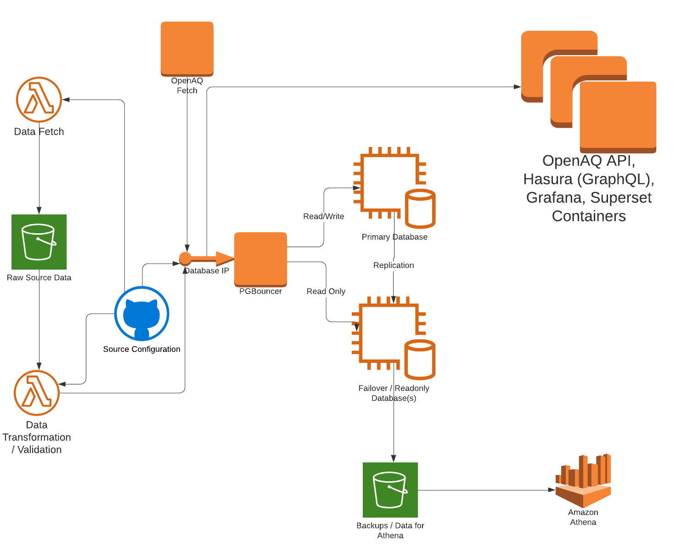
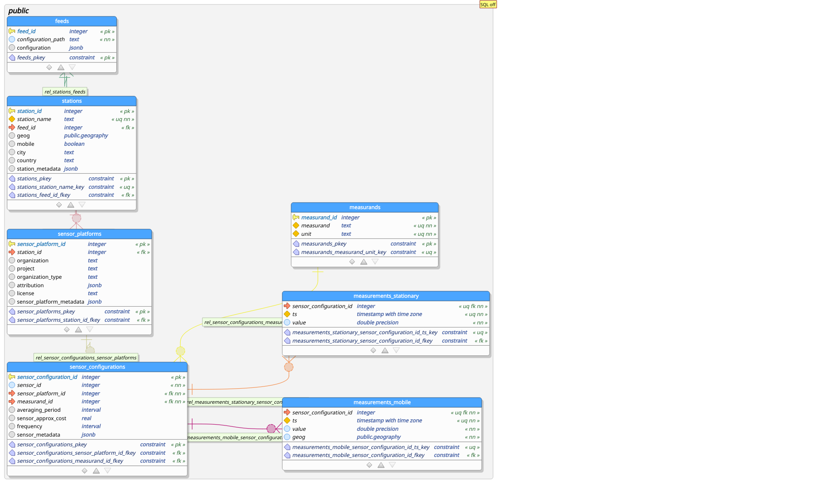

# Pilot project for OpenAQ Low Cost Sensors

## Background
 - [Initial Scoping Doc](https://docs.google.com/document/d/1L5No8GH-6NxiI0uMvdbRbyf_Vo0DUy28UDeugpDQQYE/edit#heading=h.6u6a1rduxvyk)

## Summary
As OpenAQ looks to expand to pulling in Low Cost Sensor Data, the overaarching limitation is due to the large overall change in scale in the quantity of data. OpenAQ currently uses approaches with saving data on S3 to overcome these limitations, but use of Athena over S3 has limitations on the ability to create real time interactions with the API.

## Database Updates
The primary focus of this document is to revamp the database backend used by OpenAQ to accomplish three goals.
 - Vastly expand the quantity of data able to be stored within the database.
 - Allow the database to handle a larger fire hose of incoming data.
 - Allow for incrementally updated aggregated data to reduce query load for most situations

### Data Normalization

Currently OpenAQ data is stored in a very flat structure. The key recommendation for updating the backend for this project is to normalize the database structure for stored measurements and metadata.

Please see [here](db/data_model.sql) for a recommended data model to accomodate incoming data.

#### Search and Explore
By separating the metadata from the actual measurements, it becomes much more effective to search and explore the data holdings. Rather than needing to search through GB to TB worth of data, the metadata records generally require on the order of 10s of MB worth of data making any sort of search/filtering operations much simpler to develop.

#### Database Size
By including only the minimal amount of data (a sensor id, a measurement, and a time for stationary data, an additional location column for mobile data) and storing all other information that is currently duplicated with each measurement in side tables. Simply by normalizing the data, the size of data can be shrunk by more than an order of magnitude. Using the current 90 days of (stationary) data stored in OpenAQ takes about 30GB for the data and over 100GB for the indexes. By normalizing the data, the data takes up 2GB with around 2GB for indexes.

It should be noted, that decreasing the size of data and particularly of required indexes is important not just to limit the size of data on disk, but it also increases the amount of information that is able to be held in memory during operation massively speeding up queries against the data.

## TimescaleDB

[TimescaleDB](https://www.timescale.com/) is an extension to the currently used PostgreSQL database that provides additional functionality and performance improvements for temporal data.

### Compression
TimescaleDB allows additional compression for data which on the 90 day sample further reduces the size on data from the normalized data from 2GB to 200MB.

### Partioning
TimescaleDB automatically creates partions for the temporal data which can vastly increase the speed for tasks such as index maintenance, insert/update/delete speed, and vacuum operations.

### Continuous Aggregates / Statistics
For aggregations with a temporal component (such as hourly or daily summary statistics), TimescaleDB provides automatically updated materialized views. By redirecting any API's that create statistics over periods of time to these views, there can be huge speed savings.

Fully optimized views for common usage patterns - particularly aggregation - should be created to help allow people with limited SQL experience or accessing through tools interacting through either the API or direct database connection to be able to get results easy with minimal impact on system load.

### Still PostgreSQL
Because TimescaleDB is an extension on top of PostgreSQL, all functionality of PostgreSQL and PostGIS are still available.

### RDS
The one major drawback to using TimescaleDB is that Amazon limits the extensions that are installable on an RDS instance and TimescaleDB is not available on RDS instances. In order to use TimescaleDB the options are self-managed PostgreSQL using EC2 or similar or to use the [TimescaleDB cloud](https://www.timescale.com/cloud).

## Database User Configuration
Currently there is a single user used for data ingest and the API. It is recommended to create separate users for different functionality.
- Data ingest (Read/Write)
- API (Read Only)
- Public Direct Access
  - Read Only
  - Limited memory settings
  - Limited statement timeouts

## Database Replication
Database replication should be considered both for purposes of High Availability as well as to be able to horizontally scale database instances. These replicas can be used to reduce the size of instance required to support a given load.

## Database Cost Estimates
The current RDS Instance for OpenAQ costs approximately $1000/month for three months of data with backups for recovery, but no failover. This instance has 600GB of disk space, 64GB of memory, and 8vcpus.

The TimescaleDB Cloud options do not quite line up with the instance type that is currently being used by OpenAQ. An IO instance with 2TB of (much faster) disk space 61GB of memory and 8vcpus is $1650/month.

An instance with failover (I presume that we would be able to access the failover machine as read only to distribute the load, but would need to clarify) with 512GB of disk space, 15GB memory, and 2 vcpus is $780/month, with double everything there for $1560/month.

To self-manage and host two instances on EC2 with failover would take a bit more time to set up to begin with and a bit of regular maintenance but would save quite a bit of money. Two storage optimized instances with 61GB of RAM, 8vcpus, and 1900GB Mounted NVME disk (much faster than EBS) would be $900 per month.

[Aiven](https://aiven.io/pricing) has fully managed instances that allow installation of TimescaleDB. A two instance plan with 700GB disk, 31GB Ram 4vcpus is $1340/month.

[ScaleGrid](https://scalegrid.io/postgresql.html) has fully managed instances that allow installation of TimescaleDB. Their instances include full admin and SSH access and allow any AWS instance type. They also appear to have some nice dashboards for looking at database activity. Three nodes with 950GB local (fast) disk, 30.5GB memory, 4vcpus is $1050/month if you provision your own resources and $1798 Fully managed. There are some good cheaper options as well the $1025 three server 16GB memory option would likely be sufficient to start with and could be scaled up later. They definitely seem to have some of the best and most flexible options.

## APIs
### Compatibility Layer for Current OpenAQ API
Through the use of Views, the normalized structure can be exposed to appear exactly the same as the current database structure to the OpenAQ API. This can allow for continued use by OpenAQ layers to the expanded set of available data.

### Direct Access Via Database Connection
By having carefully limited database user, particularly if on a read-only replica, direct database access can be made to allow any PostgreSQL or generic SQL tool access to the database.

### GraphQL through Hasura or Postgraphile
GraphQL is being more and more embraced as a generic API that can provide extreme flexibility to developers on the client side. GraphQL also can help to limit network resources by only requesting data the exact data that is needed on a client. Hasura and PostGraphile are two platforms that can directly expose a PostgreSQL schema as a GraphQL API. GraphQL also allows for real time updates between a client and server over web sockets.

## Charts and Dashboards / Downstream Viz
By allowing direct access via Database Connection or GraphQL, generic use tools can be leveraged for code and no-code creation of charts, dashboards, and other visualizations.

### Grafana
Grafana provides a UI that can be used to build vizualizations and dashboards against a database.  Grafana has direct plugins to make it easy to use TimescaleDB functionality.

### Apache Supersets
Existing knowledge within the OpenAQ community of Apache Supersets can be used to create dashboards and vizualizations.

# Data Processing Pipeline
Included in this repository is a script to load data from the current OpenAQ S3 repository allowing full data migration of all historical (and any future) OpenAQ data sources.

As a pilot for few data sources, similar hand coded solutions would be suitable.

In order to make a pipeline that is extensible by the widest possible audience, it is recommended to use a configuration rather than code driven approach. Much should be able to be reused from the EDF AQDC pipeline and the use of DataHQ data flows, but would need to be modified to match the more normalized data storage pattern needed for this project. An additional resource for a widely used platform allowing JSON based ETL processing to look to is the Open Addresses project.

# Self Deployability
Recognizaing that many members in the community may wish to replicate parts of the OpenAQ system, this architecture includes the following.
 - All Free / Open Source Components
 - Docker Compose Instance
 - Data loading / syncing scripts from S3

Further integration capabilities through PostgreSQL replication capabilities or through connectors such as Kafka messaging should be looked at.
